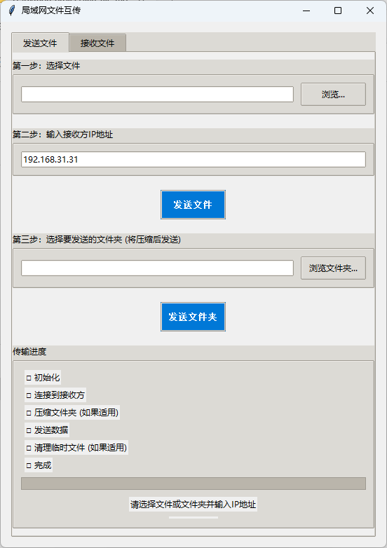
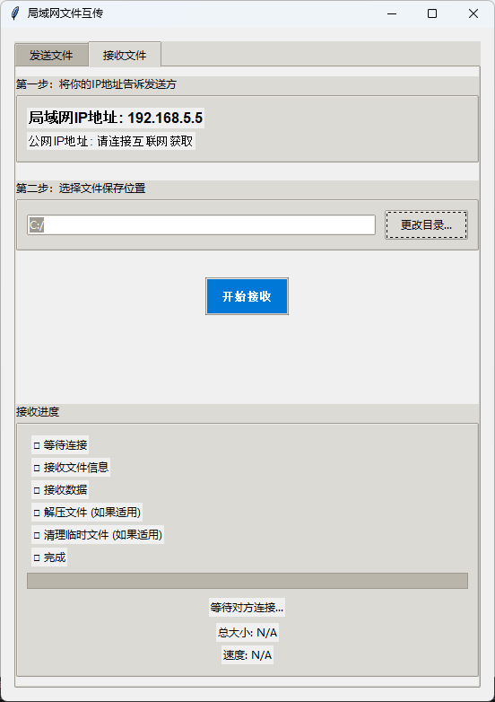

[English](README.md) | [中文](README_zh.md)

---

# 局域网文件互传工具 (LAN-Sender)

一款简洁、快速、可靠的局域网文件互传工具。基于 Python 和 Tkinter 构建，拥有直观的图形界面，无需安装任何外部依赖。

---

### 截图

*以下是发送方和接收方界面的截图。*

#### 发送方界面



#### 接收方界面



---

### ✨ 功能特性

*   **跨平台图形界面:** 基于 Python 标准库 Tkinter 构建，无需修改即可在 Windows, macOS, Linux 上运行。
*   **支持文件和文件夹:** 不仅可以发送单个文件，还能一键发送整个文件夹。文件夹会自动被压缩成 zip 包传输，接收后自动解压。
*   **断点续传:** 如果传输意外中断，程序会自动记录进度。下次传输相同文件时可从断点处继续，节省时间和带宽。
*   **高性能:** 采用多线程技术，确保图形界面在传输过程中流畅不卡顿，并使用高效的 Socket 通信，最大化利用局域网带宽。
*   **实时进度跟踪:** 清晰展示传输速度、完成百分比、文件总大小以及详细的传输步骤（如连接、压缩、发送等）。
*   **零外部依赖:** 仅需一个标准的 Python 环境即可运行，无需通过 `pip` 安装任何第三方库。
*   **智能IP识别:** 自动检测并优先显示本机在局域网中的IP地址，方便用户告知发送方。

---

### 🚀 快速开始

由于本工具没有任何外部依赖，上手非常简单。

1.  **确认已安装 Python。** 你需要 Python 3.7 或更高版本。
2.  **下载代码。**
    ```bash
    git clone https://github.com/your-username/lan-sender.git 
    cd lan-sender
    ```
    （或者直接下载 `.py` 文件。）
3.  **运行程序。**
    ```bash
    python main.py
    ```
    *(假设你已将脚本命名为 `main.py`)*

---

### 📖 如何使用

应用有两个主要选项卡：“发送文件” 和 “接收文件”。

#### 发送文件或文件夹

1.  切换到 **“发送文件”** 选项卡。
2.  **发送单个文件:** 在 “第一步：选择文件” 区域点击 “浏览...” 按钮。
3.  **发送文件夹:** 在 “第三步：选择要发送的文件夹” 区域点击 “浏览文件夹...” 按钮。
4.  在 “第二步：输入接收方IP地址” 区域填入接收方的IP地址。这个IP地址会显示在接收方的程序窗口上。
5.  点击对应的 **“发送文件”** 或 **“发送文件夹”** 按钮。
6.  底部的进度区域会实时显示传输状态。

#### 接收文件

1.  切换到 **“接收文件”** 选项卡。
2.  将你的IP地址告诉发送方，它显示在窗口顶部（例如 “局域网IP地址: 192.168.1.5”）。
3.  （可选）通过点击 “更改目录...” 来选择一个不同的文件保存位置。默认情况下，文件会保存在程序所在的当前目录。
4.  点击 **“开始接收”** 按钮。程序将进入等待连接的状态。
5.  传输完成后，如果接收的是一个文件夹（zip压缩包），程序会自动将其解压。

---

### 🤝 贡献

欢迎贡献代码！如果你有任何改进建议或发现了 Bug，请随时创建 Issue 或提交 Pull Request。

1.  Fork 本仓库。
2.  创建一个新的分支 (`git checkout -b feature/your-feature-name`)。
3.  提交您的更改 (`git commit -am 'Add some feature'`)。
4.  将分支推送到远程仓库 (`git push origin feature/your-feature-name`)。
5.  创建一个新的 Pull Request。

---

### 📄 许可证

本项目基于 MIT 许可证开源。
